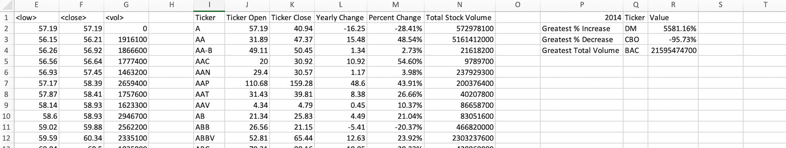

# The VBA of Wall Street

## Summary
I used VBA scripting to analyze real stock market data. 

### Stock market analyst

* I created a script that will loop through all the stocks for one year and output the following information.

  * The ticker symbol.

  * Yearly change from opening price at the beginning of a given year to the closing price at the end of that year.

  * The percent change from opening price at the beginning of a given year to the closing price at the end of that year.

  * The total stock volume of the stock.

* The solution can also return the stock with the "Greatest % increase", "Greatest % decrease" and "Greatest total volume". 

* The VBA script can also run on every worksheet, i.e., every year, just by running the VBA script once.

